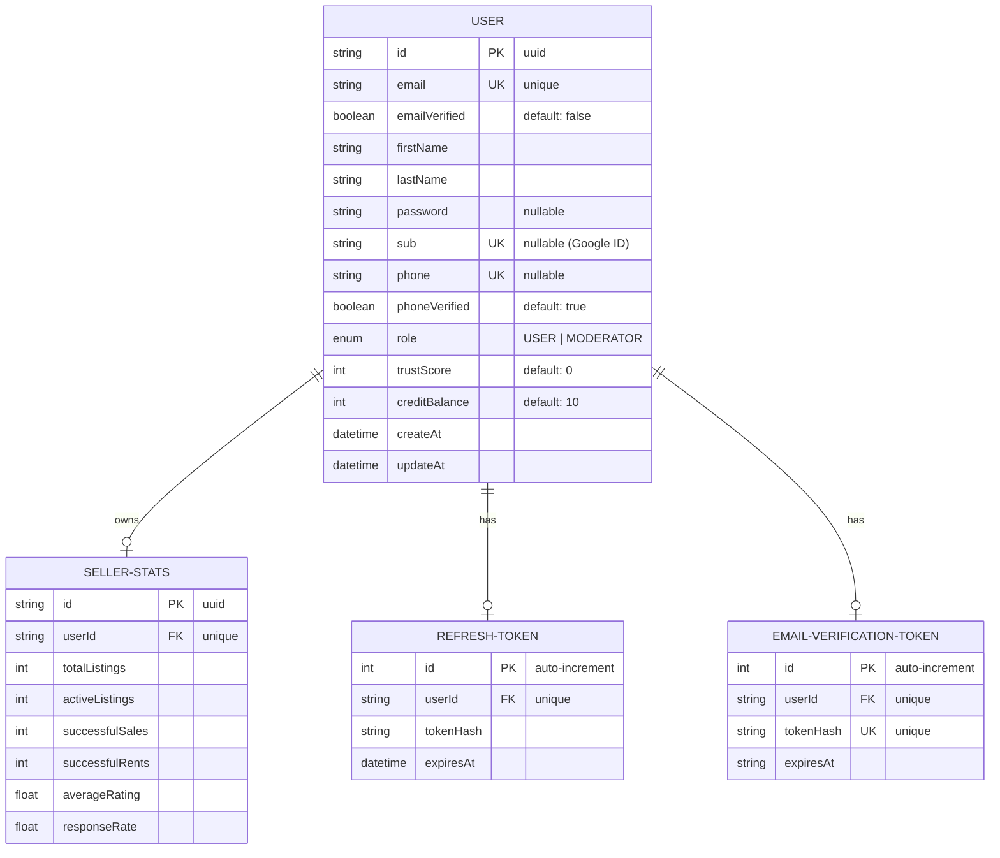

# Modèles Prisma et Architecture de base de données

## Vue d'ensemble
Le projet utilise Prisma comme ORM avec PostgreSQL. 
Actuellement, **un seul service (`auth`)** gère à la fois l'authentification et les données utilisateurs.

## Architecture base de données (`services/auth/prisma/schema.prisma`)

Toutes les tables sont gérées par le service d'authentification.



## Modèles Détaillés

### 1. User
**Responsabilité**: Cœur du système, stocke les informations d'identité et de profil.

```prisma
model User {
  id              String    @id @default(uuid())
  email           String    @unique
  emailVerified   Boolean   @default(false)
  firstName       String
  lastName        String
  password        String?   // Nullable pour OAuth users
  sub             String?   @unique // Google ID
  phone           String?   @unique
  phoneVerified   Boolean   @default(true)
  role            Role      @default(USER)
  trustScore      Int       @default(0)
  creditBalance   Int       @default(10)
  createAt        DateTime  @default(now())
  updateAt        DateTime  @updatedAt
  
  // Relations
  sellerStats             SellerStats?
  refreshToken            refresh_token?
  emailVerificationToken  email_Verification_token?
}
```

### 2. refresh_token
**Responsabilité**: Sécurisation des sessions longues durées.

```prisma
model refresh_token {
  id        Int      @id @default(autoincrement())
  userId    String   @unique
  tokenHash String
  expiresAt DateTime
  
  user      User     @relation(fields: [userId], references: [id], onDelete: Cascade)
}
```

### 3. email_Verification_token
**Responsabilité**: Gestion des tokens pour la vérification d'email.

```prisma
model email_Verification_token {
  id        Int      @id @default(autoincrement())
  userId    String   @unique
  tokenHash String   @unique
  expiresAt String   // Note: Stocké en string pour l'instant
  
  user      User     @relation(fields: [userId], references: [id], onDelete: Cascade)
}
```

### 4. SellerStats
**Responsabilité**: Statistiques pour les profils vendeurs.

```prisma
model SellerStats {
  id              String  @id @default(uuid())
  userId          String  @unique
  
  totalListings   Int     @default(0)
  activeListings  Int     @default(0)
  successfulSales Int     @default(0)
  successfulRents Int     @default(0)
  averageRating   Float   @default(0)
  responseRate    Float   @default(0)
  
  user            User    @relation(fields: [userId], references: [id], onDelete: Cascade)
  
  @@index([averageRating])
  @@index([successfulSales])
  @@index([responseRate])
}
```

## Énumérations

```prisma
enum Role {
  USER
  MODERATOR
}
```
